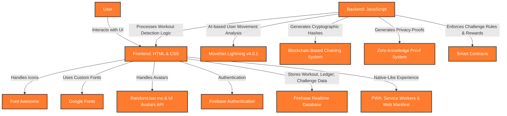

# **CashFit.ai**

**Earn While You Burn — Verifying fitness, preserving privacy, rewarding effort!**

**CashFit.ai** is an innovative **AI-driven fitness platform** that empowers users to **earn rewards by completing fitness challenges** verified through **AI form detection, human consensus, and blockchain-based cryptographic proofs** — all while maintaining **privacy, transparency, and fairness** via a **public blockchain ledger**.

## 🚀 **Demo**

[Live Demo >](https://cashfit-ai.web.app/)

> **Note:** Sensitive credentials and API keys have been omitted from the codebase.

---

## 🎯 **Problem Statement**

Staying consistent with fitness is often a battle against procrastination, loss of motivation, and lack of immediate rewards. **Despite the best intentions, people frequently skip workouts because there’s no immediate financial reward for showing up — and no real penalty for slacking off.**

**What if every completed workout could earn you real money, and skipping meant losing your staked funds?** A system where **consistency is rewarded with actual cash payouts** and **laziness results in losing your investment** taps directly into human psychology — creating powerful incentives for discipline and daily action.

**CashFit.ai** introduces this game-changing behavioral model by combining **AI-verified workouts, human validation, blockchain transparency, and a money-stake system** — making fitness a truly accountable, high-reward, and high-stakes journey where you genuinely **earn while you burn**.

---

## ✨ **Key Features**  

### **Stake & Earn**  

> **Commit money to challenges and earn more when you complete them. Financial incentives that keep you motivated and committed to your fitness journey.**

### **AI Form Check**  

> **Our AI tracks your movements in real-time, ensuring proper exercise form, preventing injuries and guaranteeing effective workouts every time.**

### **Blockchain Verification**  

> **Every workout is secured on a blockchain-like structure with zero-knowledge proofs to ensure privacy while maintaining complete transparency.**

### **Community Challenges**  

> **Join group challenges or create your own to compete with friends. Community participation increases motivation and accountability.**

### **Dual Verification**  

> **Every workout is verified by both AI and human reviewers, creating a trustless system that ensures fairness and accuracy in all challenges.**

### **Smart Contracts**  

> **Challenge funds are secured through smart contracts that automatically distribute rewards based on completion criteria without intermediaries.**

### **Zero-Knowledge Proofs**  

> **Our platform uses ZK technology to verify workout completion while preserving your privacy, allowing you to prove workout performance without revealing personal details.**

### **Public Ledger**  

> **Access our transparent public verification ledger to audit workout data, challenges, and earnings while maintaining user privacy through cryptographic hashing.**

### **Verify & Earn**  

> **Spend your free time verifying others' workout submissions and earn instant rewards, while helping ensure accuracy, fairness, and trust across the platform.**

---

## 🛠️ **Technology Stack**



- **Frontend:** HTML + CSS  
- **Backend:** JavaScript  
- **Pose Detection (AI):** TensorFlow.js MoveNet Lightning v4.0.1  
- **Icons:** Font Awesome  
- **Fonts:** Google Fonts  
- **Avatars:** RandomUser.me API + UI Avatars API  
- **Authentication:** Firebase Authentication  
- **Database:** Firebase Realtime Database  
- **Blockchain:** Cryptographic chaining of workout proofs, challenges, and earnings  
- **Zero-Knowledge Proof System:** Privacy-preserving workout validation  
- **Smart Contracts:** Automated challenge rule enforcement, staking, and reward distribution  
- **Public Ledger:** Transparent records for workouts, verifications, challenges, and earnings  
- **PWA (Progressive Web App):** Service Workers & Web Manifest  

---

## ⚙️ How It Works

### 🛡️ Our Workout Verification System

CashFit.ai utilizes zero-knowledge proofs (ZKP) to verify workout performance without revealing sensitive user information. This cryptographic technology allows users to prove they've completed exercises according to the required standards without exposing user's face, the actual workout video or any personal identifiable information.

### 🧑 Privacy Preservation
Zero-knowledge proofs allow users to maintain their privacy while still proving workout completion. Only cryptographic hashes and verification data are stored on the public ledger, not actual workout footage.

### 🔗 Immutable Verification
Each workout verification is recorded using a blockchain-like structure, making it tamper-proof and auditable by any user in the system without compromising privacy.

### 👥 Dual-Verifier System
Every workout is verified by both AI and two independent human verifiers, creating a triple-layer verification process that ensures maximum accuracy and fairness.

---

## 🔍 How CashFit.ai's Workout Verification Works

### 🏋️ Workout Performed
User completes exercise with AI form tracking

### 🧮 Data Extraction
Key metrics and form data captured

### 🧩 Data Chunking
Video divided into hashed chunks

### 🛡️ ZK Proof Creation
Cryptographic proof generated

### 👤 Dual Verification
Two human verifiers confirm proof

### 📜 Public Registry
Proof published to public ledger

---

## 🔒 Data Privacy in CashFit.ai

| Data Type             | Privacy Status | Storage Method               | Public Access                                               |
|-----------------------|----------------|-------------------------------|-------------------------------------------------------------|
| Workout Videos        | Private        | Encrypted & Chunked           | No - Only verifiers can access, with automated face blurring. |
| User Identity         | Semi-Private   | Hashed User IDs               | Yes - Only pseudonymous ID visible.                        |
| Exercise Type         | Public         | Plain Text                    | Yes - Visible to all users.                                |
| Repetition Count      | Public         | Plain Text                    | Yes - Visible to all users.                                |
| AI Form Score         | Public         | Plain Text                    | Yes - Visible to all users.                                |
| Verification Hashes   | Public         | Blockchain-like Structure     | Yes - Visible to all users.                                |
| Verification Results  | Public         | Plain Text                    | Yes - Visible to all users.                                |
| Verifier Identity     | Semi-Private   | Hashed Verifier IDs            | Yes - Only pseudonymous ID visible.                        |

---

## 🔗 Blockchain-Like Data Structure

CashFit.ai implements a blockchain-like data structure to ensure the integrity and immutability of workout data:

### 🔸 Chunked Storage
Workout videos are divided into multiple chunks (typically 900KB each) for efficient storage and verification. Each chunk contains a portion of the video data in an encrypted format.

### 🔸 Chained Hashing
Each chunk contains not only its own hash but also the hash of the previous chunk, creating a chain of hashes that ensures the integrity of the entire sequence. This makes it impossible to tamper with any single chunk without affecting the entire chain.

### 🔸 Timestamp Verification
Each chunk and verification step is timestamped, creating an auditable trail of when each action occurred, ensuring transparency in the verification process.

### 🔸 Dual-Verifier Consensus
Two independent human verifiers must reach consensus on the validity of a workout. This creates a system similar to blockchain validators, where multiple parties must agree on the state of the data.

### 🔸 Merkle Tree Validation
Workout data is organized in a Merkle tree structure where each leaf represents a specific data point (reps, form, duration, etc.). This allows for efficient and secure verification of specific data without revealing the entire dataset.

### 🔸 Tamper-Proof Storage
Once verified, workout data cannot be altered or deleted, ensuring the permanence and immutability of records. Any attempt to modify data would require changing the entire chain of hashes, which is computationally infeasible.

### 📄 Sample Chunk Structure
```json
{
    "data": "[Encrypted video data]",
    "previousHash": "0x7c2bd39a1f8e4c5b6a7d8e9f0a1b2c3d",
    "hash": "0x8fb4c3e7291b5f9d2b496e8a6dc35f107",
    "sequence": 2,
    "timestamp": 1697939472000
}
```

---

## ✅ Verification Example

### Verified: Oct 22, 2025 • 10:45 AM

### Push-Up Challenge: Day 15
- **User ID:** user_0x7c2b3...4d1e
- **Repetitions:** 20/20 (100%)
- **AI Form Score:** 96.4%
- **Duration:** 02:34
- **Verified:** Oct 22, 2025 • 10:45 AM

#### Primary Verifier
- **Verifier ID:** verifier_0x3f5e8d...
- **Verified at:** 10:32 AM

#### Secondary Verifier
- **Verifier ID:** verifier_0x9c4b7a...
- **Verified at:** 10:45 AM

### 🛡️ Zero-Knowledge Proof
```
zk-snark:0x8fb4c3e7291b5f9d2b49e6a8dc35f107b498c3a209cb4ce918e0523895603a5fc7d9ea24b10f5e682c98dcb35c4a28e16dcf86ea321b954e7ca8612c9c895d4a31b58ac97d0e3f5e60dbca15c7431d32f83ea
```

---

## 🧠 AI Model Information

The AI models used for exercise verification are transparent and version-controlled. Below are the current AI models in use:

- **Pose Detection:** TensorFlow.js MoveNet Lightning v4.0.1
- **Model Hash:** 0x7c2bd39a1f8e4c5b6a7d8e9f0a1b2c3d
- **Accuracy Rating:** 96.8%

---

## 💰 How CashFit.ai's Earnings Work

- **Activity Completion**  
  Workout verification or challenge completion triggers earning event

- **Reward Calculation**  
  System calculates appropriate reward based on verified activity

- **Transaction Signing**  
  Transaction is cryptographically signed and timestamped

- **ZK Proof Creation**  
  Cryptographic zero knowledge proof is generated

- **User Crediting**  
  Funds become available in user's wallet with transaction reference

- **Ledger Recording**  
  Transaction is recorded in public ledger with proof and details

---

## 🛡️ How CashFit.ai's Challenge Smart Contracts Work

- **Challenge Creation**  
  Challenge parameters and stake requirements are defined and deployed

- **Fund Staking**  
  Participants stake funds with contract conditions and terms

- **Workout Verification**  
  Completed workouts are verified and linked to challenge

- **Completion Validation**  
  Contract validates completion criteria have been met

- **Reward Distribution**  
  Automatic payout to successful participants in a DeFi based protocol

- **Ledger Recording**  
  Challenge data is recorded in public ledger with proof and details

---

## 🧮 Calculation behind AI-powered Workout Verification

- **AI Pose Detection**  
  Continuous monitoring of joint angles and body positions

- **Angle Measurements**  
  Precise tracking of joint angles for exercise-specific validation

- **State Management**  
  Up/down state tracking to prevent double-counting and ensuring accuracy

- **Real-time Feedback**  
  Instant coaching cues for form correction

- **Visibility Checks**  
  Ensuring full body and critical joints are captured

- **Confidence Threshold**  
  Minimum 0.5 pose confidence for reliable detection

---

## 🏋️‍♂️ Exercise-Specific Validation Rules

### Push-ups
- Tracks: Shoulders, elbows, wrists, hips
- Up position: Elbow angle > 160°
- Down position: Elbow angle < 90°

### Squats
- Tracks: Knee angles
- Standing: Knee angle > 160°
- Squatting: Knee angle < 90°

### Planks
- Measures: Back straightness
- Valid angle: > 160°
- Time-based tracking

### Lunges
- Tracks: Alternating legs
- Bend: Knee < 100°
- Straight: Knee > 140°

### Jumping Jacks
- Tracks: Wrist and ankle distances
- Measures: Spread positions
- Normalized thresholds

### Mountain Climbers
- Tracks: Knee lift towards chest & knee-to-torso distance
- Forward Drive: Knee angle < 90° & distance < 30% of torso length
- Reset Position: Knee angle > 160° & distance > 60% of torso length

---

## 📋 **Impact & Benefits**

- **Earn Real Rewards for Fitness:** CashFit.ai transforms workouts into tangible financial rewards, boosting motivation and consistency through real stakes.

- **Stay Accountable with Proof:** Every workout is verified through AI and human validation, ensuring fairness, transparency, and true accountability.

- **Privacy-Preserving Fitness:** Advanced encryption, face masking, and zero-knowledge proofs ensure users’ workout data remains private and secure.

- **Gamified Motivation System:** By staking money on challenges, users experience a powerful mix of reward-driven dopamine boosts and penalty-driven discipline.

- **Immutable Workout History:** Blockchain-style records provide a tamper-proof, verifiable public ledger of workouts, verifications, challenges, and earnings.

---

## 🚀 Getting Started

### Requirements:
- A modern web browser with JavaScript enabled.
- Stable internet connection for loading media and syncing data.

### Steps:
1. Download the app from website.
2. Sign-up to make your account.
3. Join challenges, stake your entry, and start verified workouts to earn real rewards!

---

## ⚠️ **Important Note**

- Our app runs the ML model directly in your browser using JavaScript, instead of using a backend server.

- The model is large and takes time to load.

- Workout detection feature might not work until the model has loaded completely.

- Make sure hardware and graphics acceleration are enabled in your browser for the features to work as intended.

- If your device has low processing power, the model may not load properly.

---

## 🤝 **Contributing**  

Contributions are always welcome! Please follow these steps:

1. Fork the repository.  
2. Create a new branch (`git checkout -b feature/your-feature`).  
3. Commit your changes (`git commit -m 'Add your message'`).  
4. Push to the branch (`git push origin feature/your-feature`).  
5. Open a pull request.  

---

Built with ❤️ to make fitness more rewarding, accountable, and transparent with AI and Blockchain.
